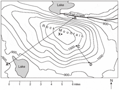
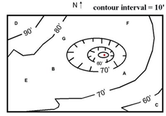
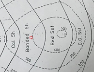
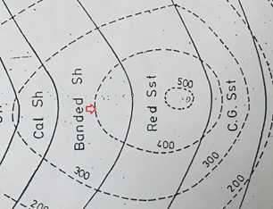
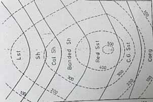

## Post test
 
Q 1. What is the elevation of point B? 

 
a. 800 ft 
b. 1000 ft 
c. 850 ft 
<b>d. 900 ft</b>  

Q 2. What could be the lowest elevation in the depression? 

 
a. 800 ft 
b. 1000 ft 
<b>c. 850 ft</b> 
d. 900 ft  

Q 3. What type of rock is present on the pointed region of the map shown below?   

   
<b>a. Banded Shale</b> 
b. Shale 
c. Limestone 
d. Conglomerate  

Q 4. What is the contour interval of the map shown below?   

   
a. 500 
b. 300 
<b>c. 100</b> 
d. 50 

Q 5. What is the elevation of the contour line pointed by the red arrow?     

 
a. 300 
<b>b. 400</b> 
c. 150 
d. 550 
