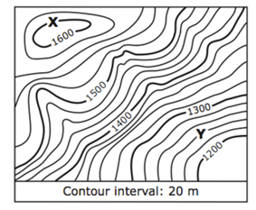
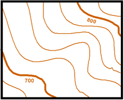
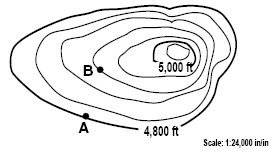
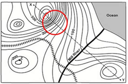

## <b> Pre-test </b>
#### Please attempt the following questions

Q 1. Contour lines on a topographic map that are far apart indicate that 
  a. The elevation is very low 
  b. The land is very steep 
  <b>c. The land has a gentle slope</b> 
  d. All of the above  

Q 2. What is the difference in elevation between Point X and Point Y?

 
  a. 120m 
  b. 340m 
  <b>c. 360m</b> 
  d. 240m  

Q 3. Determine the contour interval 
 
  a. 10 
  <b>b. 20</b> 
  c. 50 
  d. 100  

Q 4. What is elevation at B? 
 
  a. 5,080 ft 
  b. 5,040 ft 
  <b>c. 4,920 ft</b> 
  d. 4,840ft  

Q 5. What do close contour lines represent on a map?   
 
  a. Water fall 
  <b>b. Steep area</b> 
  c. Gradual area 
  d. River  
