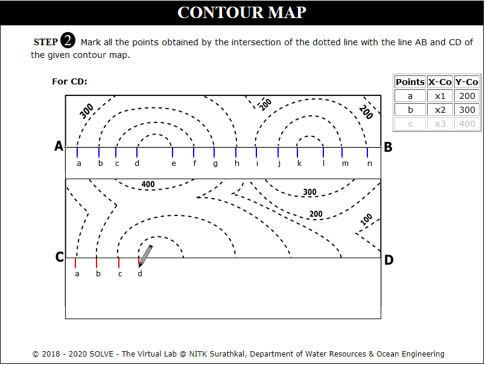

### These procedure steps will be followed on the simulator

#### Contour Map 1

1. Speed control pointer is given on top left of the screen, respective height is displayed below it and on the bottom left one checkbox for the graph is available. 
 

2. Click on rectangular box to select the section where profiles are created. Click Next button to proceed. 
 

3. Click on Get paper and Mark Points to mark lines intersecting the profiles. Click Next Button to proceed. 
 

4. Click on Plot X Axis, Plot Y Axis, Points on X Axis, Points on Y Axis to plot axis of the graph. Click Next Button to proceed. 
 

5. Click on Define Coordinates and click on each point to plot on the graph for AB profile. Click Next Button to proceed. 
 

6. Click on Plot Y’X:1550 Y:0 and Join Point to join all the plotted points in the graph. Click Next Button to proceed. 
 

7. Repeat the same steps for profile CD and Click on each label button to see the different graph. 
 

#### Contour Map 2

1. Click on the Contour Map 2 file, a window will open, to proceed, click on Next button. 
 

2. Click on get paper option to obtain the blank white paper on the canvas. 
 

3. Click on Mark points option in order to obtain the points on the XY line. 
 

4. Mark all the points on the XY line that is obtained by the intersection of the dotted line or solid line then click on Next button to proceed. 
 

5. Click on Points on X-Axis option to identify the X-axis and Y-axis. 
 

6. Click on Define Co-ordinates option to define the X-axis and Y-axis. 
 

7. Click on Points to plot option to proceed further. 
 

8. Click on each point in order to plot them on the graph, click on Next button to proceed. 
 

9. Click on Plot Y' X:1520 Y:0 to draw a perpendicular line to X Axis. 
 

10. Click on Join Points to join the plotted points. 
 

11. Click on Draw Tunnel option in-order to obtain the tunnel of Y=190 and Y=210, answer the question displayed, click on Next button. 
 

12. View the formula to calculate the Index value, click on Next button to proceed. 
 

13. Enter the values from the graph provided to proceed further in-order to obtain the required result. 
 

14. View the results of all the sections, click on Next button. 
 

15. Click on lines parallel to X Axis to view the soil distribution. 
 

16. Click on Contour Map option to view the map. 
 
